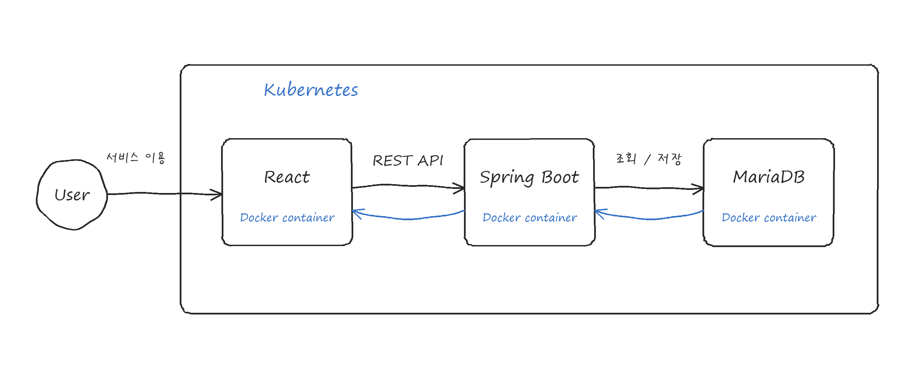
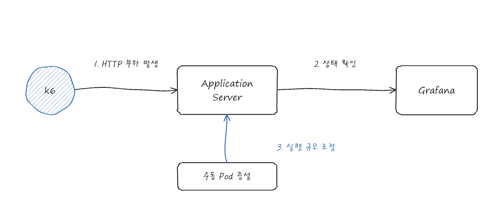

# 나만의 도서관

**Docker와 Kubernetes 기반 클라우드 배포 및 운영**

- 담당 역할: 프론트엔드 및 백엔드 개발, 클라우드 배포 환경 구축, Jenkins 빌드 자동화
- 기술: React, Java, Spring Boot, Spring Data JPA, MariaDB, Docker, Kubernetes, Jenkins, k6, Grafana
- GitHub: [백엔드](https://github.com/unfl1/mylibraryback) / [프론트엔드](https://github.com/unfl1/mylibraryfront) / [클라우드 배포 버전](https://github.com/unfl1/mylibrary)

## 시스템 구조

## 핵심 기능

- 도서 공유 - 도서 대여 게시글 등록, 목록 및 상세 조회, 제목 검색, 본인 게시글 조회와 삭제
- 이미지 및 댓글 - 게시글 이미지 첨부와 조회, 댓글 기능
- 회원 - 회원가입과 로그인

직접 개발한 서비스를 대상으로 Docker 이미지 구성, Kubernetes 배포 환경 구축, Jenkins 빌드 자동화, k6 부하 테스트 및 수동 Pod 확장 수행

## 배포 환경 구축

### 1. 프론트엔드 및 백엔드 컨테이너화와 Kubernetes 배포

#### 구성

| 배포 대상 | 이미지 구성 | 실행 방식 |
| --- | --- | --- |
| 프론트엔드 | Node.js 20.12.2 기반, 의존성 설치 후 React 빌드 | `serve -s build`로 정적 파일 제공, 포트 3000 |
| 백엔드 | OpenJDK 17 기반, 빌드된 JAR을 `/app/app.jar`로 복사 | `java -jar app.jar`로 실행, 포트 8080 |

#### 구축 과정

- 프론트엔드와 백엔드 저장소 분리 및 개별 Dockerfile 작성
- 프론트엔드 이미지 빌드 시 `npm install`과 `npm run build` 실행, `serve`를 통한 빌드 결과물 제공
- 백엔드 이미지에 `build/libs`의 JAR 포함 및 Java 17 실행 환경 구성
- 생성한 Docker 이미지를 사용한 클라우드 Kubernetes 환경 배포
- 배포 환경에 맞게 DB 연결, 외부 API 접근, 이미지 파일 저장 위치 조정

#### 결과

- 프론트엔드와 백엔드 컨테이너의 Kubernetes 환경 실행
- Dockerfile을 통한 서비스별 실행 환경과 시작 명령 관리

### 2. GitHub Webhook과 Jenkins 연동 및 빌드 자동화

#### 구성

#### 구축 과정

- 클라우드 서버에 Jenkins 설치 및 GitHub 저장소 Webhook 연동
- 코드 push 시 Jenkins 빌드 자동 실행 설정
- Jenkins 빌드 실행 결과 확인

#### 결과

- GitHub 코드 변경 감지부터 Jenkins 빌드 실행까지 자동화

### 3. k6 부하 테스트와 수동 Pod 확장

#### 수행 구성

| 도구 | 수행 내용 |
| --- | --- |
| k6 | 배포된 서비스에 HTTP 요청을 보내 부하 발생 |
| Kubernetes | Pod 수를 수동으로 늘리는 스케일 아웃 수행 |
| Grafana | 대시보드에서 배포 환경의 상태 확인 |

#### 수행 과정

- Kubernetes에 배포한 서비스를 대상으로 k6 부하 테스트 수행
- 부하 테스트 과정에서 Pod 수 수동 증설 및 서비스 실행 규모 조정
- Grafana 대시보드를 통한 배포 환경 상태 확인

#### 수행 결과

- 클라우드 서비스 부하 테스트 및 Kubernetes 수동 스케일 아웃 수행
