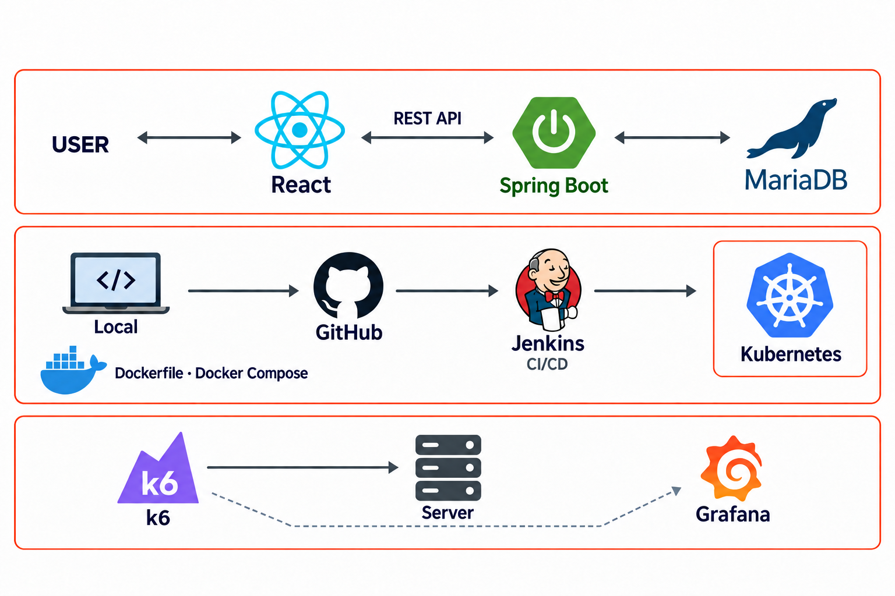

# 나만의 도서관

**도서 공유 서비스 개발과 배포 자동화 실습**

**담당 역할**　프론트엔드·백엔드 개발 · 배포 환경 및 CI/CD 구축  
**기술**　React, Spring Boot, Spring Data JPA, MariaDB, Docker, Docker Compose, Kubernetes, Jenkins, k6, Grafana  
**GitHub**　[unfl1/mylibrary](https://github.com/unfl1/mylibrary)

직접 개발한 도서 대여 서비스를 배포 대상으로 삼아, **Docker 이미지 구성 → Kubernetes 배포 → Jenkins 빌드 자동화**로 이어지는 작업을 진행했습니다. 클라우드 서버에 Jenkins를 설치하고 GitHub Webhook을 연결했으며, 배포된 서비스를 대상으로 k6 부하 테스트와 Grafana 모니터링을 실습했습니다.

## 시스템 구조

## 주요 작업

### 1. 애플리케이션을 컨테이너 단위로 배포

로컬 개발 버전에서 프론트엔드와 백엔드를 별도 저장소로 분리하고, 각각 Dockerfile을 작성해 이미지로 패키징했습니다. 이 이미지를 활용해 Kubernetes 환경에서 서비스를 실행했습니다.

| 배포 단위 | 이미지에 구성한 실행 환경 | 구현 근거 |
| --- | --- | --- |
| 프론트엔드 | Node.js 환경에서 React를 빌드하고 `serve`로 정적 파일 제공 | [프론트엔드 Dockerfile](https://github.com/unfl1/mylibraryfront/blob/master/Dockerfile) |
| 백엔드 | 빌드한 JAR을 이미지에 포함하고 Java 17로 실행 | [백엔드 Dockerfile](./Dockerfile) |

환경 전환 시에는 DB 연결, 외부 API 접근, 이미지 파일 저장 위치를 배포 환경에 맞게 조정했습니다. 로컬 프로세스끼리 연결하던 구성을 컨테이너 실행 위치와 접근 경로에 맞춰 옮겼습니다.

### 2. Jenkins CI/CD 구축

클라우드 서버에 Jenkins를 설치하고 GitHub Webhook을 연동해 **코드를 push하면 빌드가 자동으로 실행되도록 구성**했습니다. 코드 변경 감지와 빌드 실행을 자동화하고, Jenkins에서 실행 결과를 확인했습니다.

### 3. k6 부하 테스트와 Grafana 모니터링

k6로 배포된 웹 서비스에 HTTP 요청을 보내 부하를 발생시켰습니다. 브라우저에서 기능을 하나씩 실행하는 확인 방식에서 나아가, 요청이 반복되는 상황에서 서비스의 동작을 살펴보는 테스트를 진행했습니다.

Grafana는 배포 환경의 상태를 대시보드로 확인하는 데 활용했습니다. k6로 요청을 발생시키는 작업과 Grafana로 상태를 관찰하는 작업을 함께 다루며, 부하 테스트와 모니터링 도구의 역할을 익혔습니다.

## 서비스와 저장소

실습 대상인 **나만의 도서관**은 개인 소유 도서의 대여 정보를 공유하는 서비스입니다. React, Spring Boot, MariaDB로 구성했으며, 도서 등록과 검색, 이미지 첨부, 댓글 기능을 제공합니다.

[로컬 개발 버전](https://github.com/unfl1/mylibrary) / [백엔드](https://github.com/unfl1/mylibraryback) / [프론트엔드](https://github.com/unfl1/mylibraryfront)
